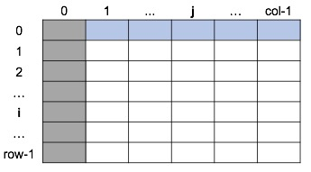

### 方法一 [Accept]

如果元素matrix\[i\]\[j\]为0，需要将第i行和第j列设置为0。如果直接在原矩阵上设置，那么如果第i行或第j列后面的元素会被覆盖，导致后续无法判断。可以使用一个矩阵flags，如果原矩阵中matrix\[i\]\[j\]为0，那么将flags\[i\]\[j\]设置为0，然后根据flags中为0的元素来设置原矩阵中的0

**空间代价**：$)

```c++
class Solution {
public:
    void setZeroes(vector<vector<int>>& matrix) {
        vector<vector<int>> flags;
        
        for(int i = 0;i < matrix.size();i++){
            vector<int> tp;
            for(int j = 0;j < matrix[i].size();j++){
                if(matrix[i][j] == 0)   tp.push_back(0);
                else    tp.push_back(-1);
            }
            flags.push_back(tp);
        }
        
        for(int i = 0;i < flags.size();i++){
            for(int j = 0;j < flags[i].size();j++){
                if(flags[i][j] == 0){
                    for(int m = 0;m < matrix.size();m++)    matrix[m][j] = 0;
                    for(int n = 0;n < matrix[0].size();n++) matrix[i][n] = 0;
                }
            }
        }
    }
};
```

### 方法二 [Accept]

方法一的空间代价为 $)，考虑能否减少。可以使用两个数组rows和columns，如果元素matrix\[i\]\[j\]为0，那么
将第i行和第j列设置为0，即，

**空间代价**： $)

```c++
class Solution {
public:
    void setZeroes(vector<vector<int>>& matrix) {
        if(matrix.empty())  return;
        
        vector<int> rows,columns;
        
        for(int i = 0;i < matrix.size();i++){
            rows.push_back(-1);
        }
        for(int j = 0;j < matrix[0].size();j++){
            columns.push_back(-1);
        }
        
        for(int i = 0;i < matrix.size();i++){
            for(int j = 0;j < matrix[i].size();j++){
                if(matrix[i][j] == 0){
                    rows[i] = 0;
                    columns[j] = 0;
                }
            }
        }
        
        for(int i = 0;i < rows.size();i++){
            if(rows[i] == 0)
                for(int j = 0;j < columns.size();j++)
                    matrix[i][j] = 0;
        }
        for(int j = 0;j < columns.size();j++){
            if(columns[j] == 0)
                for(int i = 0;i < rows.size();i++)
                    matrix[i][j] = 0;
        }
    }
};
```

### 方法三 [Accept]

可以使用第0行和第0列存储状态，从而避免空间开销



```c++
class Solution {
public:
    void setZeroes(vector<vector<int>>& matrix) {
        bool col0 = false;
        int rows = matrix.size();
        int columns = rows > 0 ? matrix[0].size() : 0;
        
        for(int i = 0;i < rows;i++){
            if(matrix[i][0] == 0) col0 = true;
            for(int j = 1;j < columns;j++){
                if(matrix[i][j] == 0)
                    matrix[i][0] = matrix[0][j] = 0;
            }
        }
        
        for(int j = 1;j < columns;j++)
            if(matrix[0][j] == 0)
                for(int i = 1;i < rows;i++)
                    matrix[i][j] = 0;
        
        for(int i = 0;i < rows;i++)
            if(matrix[i][0] == 0)
                for(int j = 1;j < columns;j++)
                    matrix[i][j] = 0;
        
        if(col0)
            for(int i = 0;i < rows;i++)
                matrix[i][0] = 0;
        
    }
};
```

**空间代价**： $)
