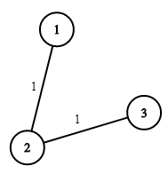

# 1168. Optimize Water Distribution in a Village

Difficulty: Hard

https://leetcode.com/problems/optimize-water-distribution-in-a-village/

There are n houses in a village. We want to supply water for all the houses by building wells and laying pipes.

For each house i, we can either build a well inside it directly with cost wells[i], or pipe in water from another well to it. The costs to lay pipes between houses are given by the array pipes, where each pipes[i] = [house1, house2, cost] represents the cost to connect house1 and house2 together using a pipe. Connections are bidirectional.

Find the minimum total cost to supply water to all houses.

**Example 1:**  

```
Input: n = 3, wells = [1,2,2], pipes = [[1,2,1],[2,3,1]]
Output: 3
Explanation: 
The image shows the costs of connecting houses using pipes.
The best strategy is to build a well in the first house with cost 1 and connect the other houses to it with cost 2 so the total cost is 3.
```

**Constraints:**

* 1 <= n <= 10000
* wells.length == n
* 0 <= wells[i] <= 10^5
* 1 <= pipes.length <= 10000
* 1 <= pipes[i][0], pipes[i][1] <= n
* 0 <= pipes[i][2] <= 10^5
* pipes[i][0] != pipes[i][1]
