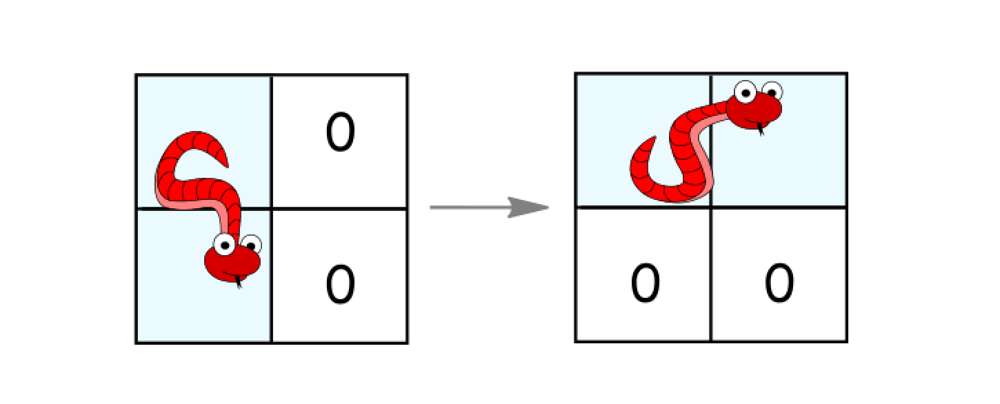
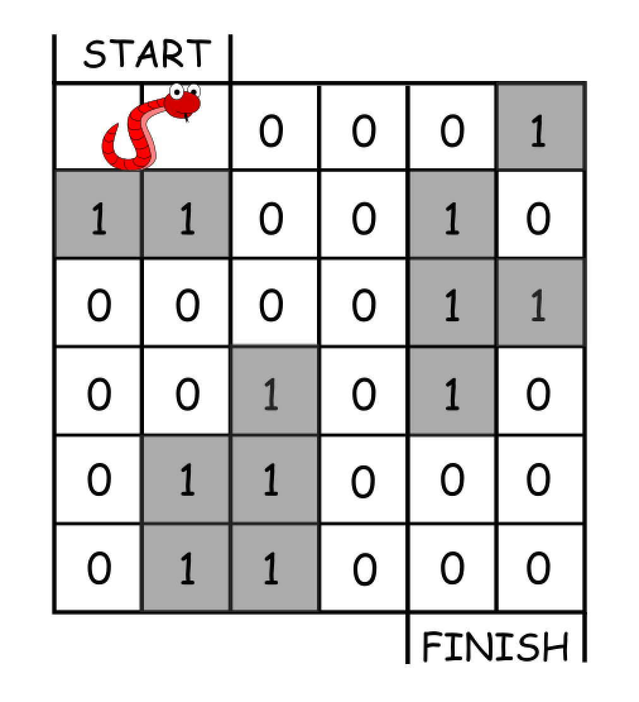

# 1210. Minimum Moves to Reach Target with Rotations

Difficulty: Hard

https://leetcode.com/problems/minimum-moves-to-reach-target-with-rotations/

In an n*n grid, there is a snake that spans 2 cells and starts moving from the top left corner at (0, 0) and (0, 1). The grid has empty cells represented by zeros and blocked cells represented by ones. The snake wants to reach the lower right corner at (n-1, n-2) and (n-1, n-1).

In one move the snake can:

* Move one cell to the right if there are no blocked cells there. This move keeps the horizontal/vertical position of the snake as it is.
* Move down one cell if there are no blocked cells there. This move keeps the horizontal/vertical position of the snake as it is.
* Rotate clockwise if it's in a horizontal position and the two cells under it are both empty. In that case the snake moves from (r, c) and (r, c+1) to (r, c) and (r+1, c).


* Rotate counterclockwise if it's in a vertical position and the two cells to its right are both empty. In that case the snake moves from (r, c) and (r+1, c) to (r, c) and (r, c+1).



Return the minimum number of moves to reach the target.

If there is no way to reach the target, return -1.

**Example 1:**  

```
Input: grid = [[0,0,0,0,0,1],
               [1,1,0,0,1,0],
               [0,0,0,0,1,1],
               [0,0,1,0,1,0],
               [0,1,1,0,0,0],
               [0,1,1,0,0,0]]
Output: 11
Explanation:
One possible solution is [right, right, rotate clockwise, right, down, down, down, down, rotate counterclockwise, right, down].
```

**Example 2:**
```
Input: grid = [[0,0,1,1,1,1],
               [0,0,0,0,1,1],
               [1,1,0,0,0,1],
               [1,1,1,0,0,1],
               [1,1,1,0,0,1],
               [1,1,1,0,0,0]]
Output: 9
```

**Constraints:**

* 2 <= n <= 100
* 0 <= grid[i][j] <= 1
* It is guaranteed that the snake starts at empty cells.
