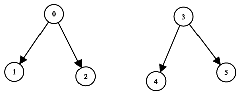

# 1361. Validate Binary Tree Nodes

Difficulty: Medium

https://leetcode.com/problems/validate-binary-tree-nodes/

You have n binary tree nodes numbered from 0 to n - 1 where node i has two children leftChild[i] and rightChild[i], return true if and only if all the given nodes form exactly one valid binary tree.

If node i has no left child then leftChild[i] will equal -1, similarly for the right child.

Note that the nodes have no values and that we only use the node numbers in this problem.

**Example 1:**  

```
Input: n = 4, leftChild = [1,-1,3,-1], rightChild = [2,-1,-1,-1]
Output: true
```

**Example 2:**  

```
Input: n = 4, leftChild = [1,-1,3,-1], rightChild = [2,3,-1,-1]
Output: false
```

**Example 3:**  

```
Input: n = 2, leftChild = [1,0], rightChild = [-1,-1]
Output: false
```

**Example 4:**  

```
Input: n = 6, leftChild = [1,-1,-1,4,-1,-1], rightChild = [2,-1,-1,5,-1,-1]
Output: false
```

**Constraints:**

* 1 <= n <= 10^4
* leftChild.length == rightChild.length == n
* -1 <= leftChild[i], rightChild[i] <= n - 1
