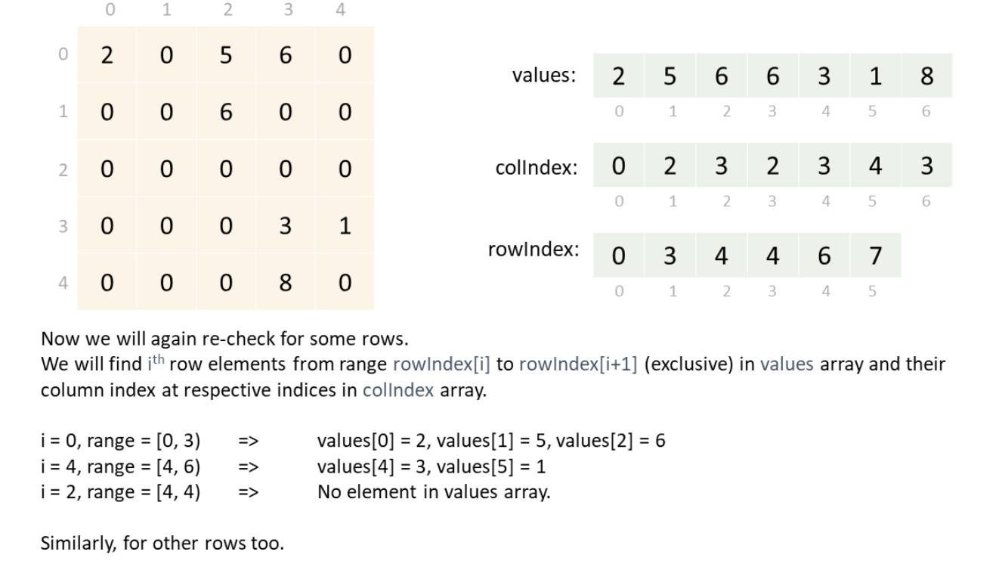

# [311. Sparse Matrix Multiplication (Medium)](https://leetcode.com/problems/sparse-matrix-multiplication/)

<p>Given two <a href="https://en.wikipedia.org/wiki/Sparse_matrix" target="_blank">sparse matrices</a> <code>mat1</code> of size <code>m x k</code> and <code>mat2</code> of size <code>k x n</code>, return the result of <code>mat1 x mat2</code>. You may assume that multiplication is always possible.</p>

<p>&nbsp;</p>
<p><strong>Example 1:</strong></p>

<pre><strong>Input:</strong> mat1 = [[1,0,0],[-1,0,3]], mat2 = [[7,0,0],[0,0,0],[0,0,1]]
<strong>Output:</strong> [[7,0,0],[-7,0,3]]
</pre>

<p><strong>Example 2:</strong></p>

<pre><strong>Input:</strong> mat1 = [[0]], mat2 = [[0]]
<strong>Output:</strong> [[0]]
</pre>

<p>&nbsp;</p>
<p><strong>Constraints:</strong></p>

<ul>
	<li><code>m == mat1.length</code></li>
	<li><code>k == mat1[i].length == mat2.length</code></li>
	<li><code>n == mat2[i].length</code></li>
	<li><code>1 &lt;= m, n, k &lt;= 100</code></li>
	<li><code>-100 &lt;= mat1[i][j], mat2[i][j] &lt;= 100</code></li>
</ul>


**Companies**:  
[Facebook](https://leetcode.com/company/facebook), [Snapchat](https://leetcode.com/company/snapchat), [Apple](https://leetcode.com/company/apple), [Databricks](https://leetcode.com/company/databricks)

**Related Topics**:  
[Array](https://leetcode.com/tag/array/), [Hash Table](https://leetcode.com/tag/hash-table/), [Matrix](https://leetcode.com/tag/matrix/)

## Solution 1. Brute Force

No optimization at all

```cpp
// OJ: https://leetcode.com/problems/sparse-matrix-multiplication/
// Author: github.com/lzl124631x
// Time: O(MNK)
// Space: O(1)
class Solution {
public:
    vector<vector<int>> multiply(vector<vector<int>>& A, vector<vector<int>>& B) {
        int M = A.size(), K = A[0].size(), N = B[0].size();
        vector<vector<int>> ans(M, vector<int>(N));
        for (int i = 0; i < M; ++i) {
            for (int j = 0; j < N; ++j) {
                for (int k = 0; k < K; ++k) {
                    ans[i][j] += A[i][k] * B[k][j];
                }
            }
        }
        return ans;
    }
};
```

## Solution 2. Naive Iteration

Loop for each `i, k, j` instead, so that if `A[i][k] == 0`, we can skip the `O(N)` iteration.

```cpp
// OJ: https://leetcode.com/problems/sparse-matrix-multiplication/
// Author: github.com/lzl124631x
// Time: O(MKN)
// Space: O(1)
class Solution {
public:
    vector<vector<int>> multiply(vector<vector<int>>& A, vector<vector<int>>& B) {
        int M = A.size(), K = A[0].size(), N = B[0].size();
        vector<vector<int>> ans(M, vector<int>(N));
        for (int i = 0; i < M; ++i) {
            for (int k = 0; k < K; ++k) {
                if (A[i][k] == 0) continue;
                for (int j = 0; j < N; ++j) {
                    ans[i][j] += A[i][k] * B[k][j];
                }
            }
        }
        return ans;
    }
};
```


## Solution 3. Compress Matrices

For each row of `A`, only store the column indices of non-zero values in array `X`.

If `A = [[1,0,0],[-1,0,3]]`, then `X = [[0], [0, 2]]`.

For each column of `B`, only store the row indices of non-zero values in array `Y`.

If `B = [[7,0,0],[0,0,0],[0,0,1]]`, then `Y = [[0], [], [2]]`.

Then, for each row and column index combination `i, j`, we can use two pointers `a, b` to traverse `X[i]` and `Y[j]`, and only add `A[i][X[i][a]] * B[X[i][a]][j]` to the answer if `X[i][a] == Y[j][b]`.

```cpp
// OJ: https://leetcode.com/problems/sparse-matrix-multiplication/
// Author: github.com/lzl124631x
// Time: O(MNK)
// Space: O(MK + KN)
class Solution {
public:
    vector<vector<int>> multiply(vector<vector<int>>& A, vector<vector<int>>& B) {
        int M = A.size(), K = A[0].size(), N = B[0].size();
        vector<vector<int>> X(M), Y(N), ans(M, vector<int>(N));
        for (int i = 0; i < M; ++i) {
            for (int j = 0; j < K; ++j) {
                if (A[i][j]) X[i].push_back(j);
            }
        }
        for (int i = 0; i < N; ++i) {
            for (int j = 0; j < K; ++j) {
                if (B[j][i]) Y[i].push_back(j);
            }
        }
        for (int i = 0; i < M; ++i) {
            for (int j = 0; j < N; ++j) {
                for (int a = 0, b = 0; a < X[i].size() && b < Y[j].size();) {
                    if (X[i][a] < Y[j][b]) ++a;
                    else if (X[i][a] > Y[j][b]) ++b;
                    else {
                        ans[i][j] += A[i][X[i][a]] * B[X[i][a]][j];
                        ++a, ++b;
                    }
                }
            }
        }
        return ans;
    }
};
```

## Solution 4. Compress Matrices (Yale Format)

Another way to efficiently store a matrix is using [Yale format](https://en.wikipedia.org/wiki/Sparse_matrix#:~:text=matrix%20construction.%5B6%5D-,Compressed%20sparse%20row%20(CSR%2C%20CRS%20or%20Yale%20format),-%5Bedit%5D).

Yale format or **Compressed Sparse Row (CSR)** represents a matrix using 3 (one dimensional) arrays: `values`, `rowIndex`, and `colIndex`.

* `values` array contains all the non-zero elements of the matrix.
* `colIndex` array contains the column index of all the non-zero elements in `values` array.
* `rowIndex` array stores the start index of each row's elements in the `values` array.

Length of `values` and `colIndex` arrays will be equal to the number of non-zero elements in the matrix.

Length of `rowIndex` array will be, `number of rows + 1`, where `rowIndex[i]^{th}` to `rowIndex[i+1]^{th}` index (exclusive) will give us the index range where the `i^{th}` row elements of the matrix are stored in `values` and `colIndex` arrays.



```cpp
class SparseMatrix {
public:
    int cols = 0, rows = 0;
    vector<int> values, colIndex, rowIndex;

    // Compressed Sparse Row
    SparseMatrix(vector<vector<int>>& matrix) {
        rows = matrix.size();
        cols = matrix[0].size(); 
        rowIndex.push_back(0);
        
        for (int row = 0; row < rows; ++row) {
            for (int col = 0; col < cols; ++col) {
                if (matrix[row][col]) {
                    values.push_back(matrix[row][col]);
                    colIndex.push_back(col);
                }
            }
            rowIndex.push_back(values.size());
        }
    }

    // Compressed Sparse Column
    SparseMatrix(vector<vector<int>>& matrix, bool colWise) {
        rows = matrix.size();
        cols = matrix[0].size();
        colIndex.push_back(0);
        
        for (int col = 0; col < cols; ++col) {
            for (int row = 0; row < rows; ++row) {
                if (matrix[row][col]) {
                    values.push_back(matrix[row][col]);
                    rowIndex.push_back(row);
                }
            }
            colIndex.push_back(values.size());
        }
    }
};

class Solution {
public:
    vector<vector<int>> multiply(vector<vector<int>>& mat1, vector<vector<int>>& mat2) {
        SparseMatrix A (mat1); 
        SparseMatrix B (mat2, true);
        
        vector<vector<int>> ans(mat1.size(), vector<int>(mat2[0].size(), 0));
        
        for (int row = 0; row < ans.size(); ++row) {
            for (int col = 0; col < ans[0].size(); ++col) {
                
                // Row element range indices
                int matrixOneRowStart = A.rowIndex[row];
                int matrixOneRowEnd = A.rowIndex[row + 1];
                
                // Column element range indices
                int matrixTwoColStart = B.colIndex[col];
                int matrixTwoColEnd = B.colIndex[col + 1];
                
                // Iterate over both row and column.
                while (matrixOneRowStart < matrixOneRowEnd && matrixTwoColStart < matrixTwoColEnd) {
                    if (A.colIndex[matrixOneRowStart] < B.rowIndex[matrixTwoColStart]) {
                        matrixOneRowStart++;
                    } else if (A.colIndex[matrixOneRowStart] > B.rowIndex[matrixTwoColStart]) {
                        matrixTwoColStart++;
                    } else {
                        // Row index and col index are same so we can multiply these elements.
                        ans[row][col] += A.values[matrixOneRowStart] * B.values[matrixTwoColStart];
                        matrixOneRowStart++;
                        matrixTwoColStart++;
                    }
                }
            }
        }
        
        return ans;
    }
};
```